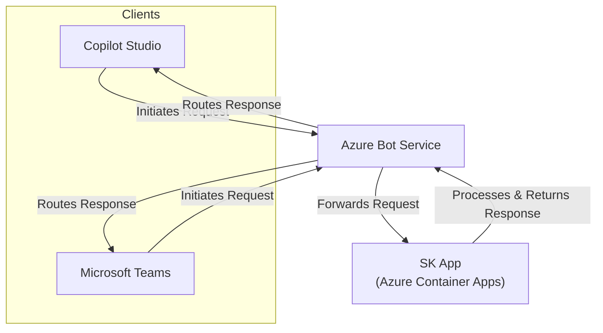

# Extend Copilot Studio with Semantic Kernel

This template demonstrates how to build a [Copilot Studio Skill](https://learn.microsoft.com/en-us/microsoft-copilot-studio/configuration-add-skills#troubleshoot-errors-during-skill-registration) that allows to extend agent capabilities with a custom API running in Azure with the help of the Semantic Kernel.

Additionally, the same approach can be used to create Microsoft Teams app.

## Rationale

[Microsoft Copilot Studio](https://learn.microsoft.com/en-us/microsoft-copilot-studio/fundamentals-what-is-copilot-studio) is a graphical, low-code tool for both creating an agent — including building automation with Power Automate — and extending a Microsoft 365 Copilot with your own enterprise data and scenarios.

However, in some cases you may need to extend the default agent capabilities by leveraing a pro-code approach, where specific requirements apply.

Using Microsoft Teams as a client for the agent, you can create a custom API that can be used to extend the agent capabilities. This API can be hosted in Azure and can leverage the Semantic Kernel to provide advanced functionality.

## Prerequisites

- Azure Subscription
- Azure CLI
- Azure Developer CLI
- Python 3.12 or later
- A Microsoft 365 tenant with Copilot Studio enabled

> [!NOTE]
> You don't need the Azure subscription to be on the same tenant as the Microsoft 365 tenant where Copilot Studio is enabled.
>
> However, you need to have the necessary permissions to register an application in the Azure Active Directory of the tenant where Copilot Studio is enabled.

## Getting Started

1. Clone this repository to your local machine.

```bash
git clone https://github.com/Azure-Samples/semantic-kernel-advanced-usage
cd semantic-kernel-advanced-usage/templates/azure-bot
```

2. Create a App Registration in Azure Entra ID, with a client secret.

```powershell
az login --tenant <COPILOT-tenant-id>
$appId = az ad app create --display-name "MyCopilotSkill" --query appId -o tsv
$secret = az ad app credential reset --id $appId --append --query password -o tsv
```

4. Run `azd up` to deploy the Azure resources.

```bash
azd auth login --tenant <AZURE-tenant-id>
azd up
```

> [!NOTE]
> When prompted, provide the `botAppId`, `botPassword` and `botTenantId` values from above.
>
> You will also need to input and existing Azure OpenAI resource name and its resource group.

> [!NOTE]
> By default, Teams App Name and ID are preset in `main.bicep` file. You can change them.

> [!TIP]
> Once the deployment is complete, you can find the URL of the deployed API in the `output` section of the Azure Developer CLI. Copy this URL.

5. Register the bot in Copilot Studio as skill

   - Open the Copilot Studio in your Microsoft 365 tenant.
   - Create a new agent or reuse an existing one.
   - Go to "Settings" in the upper right corner of the agent page.
   - Go to the "Skills" tab and click on "Add a skill".
   - Now input as URL `API_URL/manifest/copilot-studio` where `API_URL` is the URL of the deployed API.
   - Click on "Next" to register the skill.
   - Once the skill is registered, you can start using it in your agent.

6. Integrate in Microsoft Teams (OPTIONAL)

   - Open `API_URL/manifest/teams` in your browser to download the `sk-copilot.zip` file.
   - Go to https://dev.teams.microsoft.com/apps/
   - Click on "Import an app" and select the `sk-copilot.zip` file.
   - Click on "Preview in Teams" to test the app in Teams

> [!TIP]
> You can also use the Web version of Teams to test the app. Just `Cancel` the prompt to swithc the app in the desktop version.

## Architecture

For both use cases, the architecture features `Azure Bot Service` as the main entry point for the requests. The bot service is responsible for routing the requests to the appropriate backend service, which in this case is a custom API running in `Azure Container Apps` leveraging Semantic Kernel.


