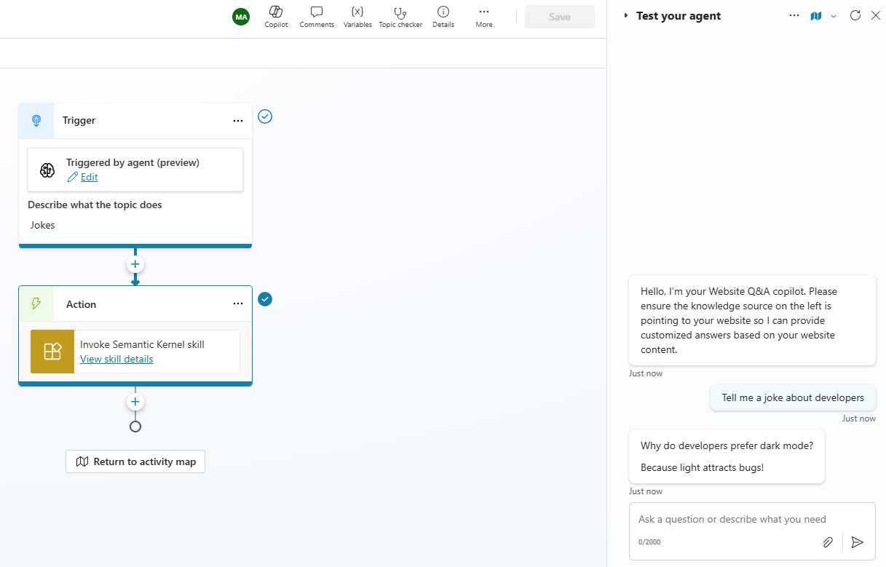

> [!TIP]
> This scenario describes how to extend the capabilities of Microsoft Copilot Studio with a custom API running in Azure with the help of the Semantic Kernel (MCS=>SK).
> If you are looking at calling a Microsoft Copilot Studio Agent from Semantic Kernel (SK=>MCS), please refer to [this other scenario](../copilot_studio/README.md).

# Extend Copilot Studio with Semantic Kernel

This template demonstrates how to build a [Copilot Studio Skill](https://learn.microsoft.com/en-us/microsoft-copilot-studio/configuration-add-skills#troubleshoot-errors-during-skill-registration) that allows to extend agent capabilities with a custom API running in Azure with the help of the Semantic Kernel.



## Rationale

[Microsoft Copilot Studio](https://learn.microsoft.com/en-us/microsoft-copilot-studio/fundamentals-what-is-copilot-studio) is a graphical, low-code tool for both creating an agent — including building automation with Power Automate — and extending a Microsoft 365 Copilot with your own enterprise data and scenarios.

However, in some cases you may need to extend the default agent capabilities by leveraing a pro-code approach, where specific requirements apply.

## Prerequisites

- Azure Subscription
- Azure CLI
- Azure Developer CLI
- Python 3.12 or later
- A Microsoft 365 tenant with Copilot Studio enabled

> [!NOTE]
> You don't need the Azure subscription to be on the same tenant as the Microsoft 365 tenant where Copilot Studio is enabled.
>
> However, you need to have the necessary permissions to register an application in the Azure Active Directory of the tenant where Copilot Studio is enabled.

## Getting Started

1. Clone this repository to your local machine.

```bash
git clone https://github.com/Azure-Samples/semantic-kernel-advanced-usage
cd semantic-kernel-advanced-usage/templates/copilot_studio_skill
```

2. Create a App Registration in Azure Entra ID, with a client secret.

```powershell
az login --tenant <COPILOT-tenant-id>
$appId = az ad app create --display-name "SKCopilotSkill" --query appId -o tsv
$secret = az ad app credential reset --id $appId --append --query password -o tsv
```

4. Run `azd up` to deploy the Azure resources.

```bash
azd auth login --tenant <AZURE-tenant-id>
azd up
```

> [!NOTE]
> When prompted, provide the `botAppId`, `botPassword` and `botTenantId` values from above.
>
> You will also need to input and existing Azure OpenAI resource name and its resource group.

> [!TIP]
> Once the deployment is complete, you can find the URL of the deployed API in the `output` section of the Azure Developer CLI. Copy this URL.

5. Ensure the App Registration `homeUrl` is set to the URL of the deployed API. This is required for the bot to be able to respond to requests from Copilot Studio.

6. Register the bot in Copilot Studio as skill

   - Open the Copilot Studio in your Microsoft 365 tenant.
   - Create a new agent or reuse an existing one.
   - Go to "Settings" in the upper right corner of the agent page.
   - Go to the "Skills" tab and click on "Add a skill".
   - Now input as URL `API_URL/manifest` where `API_URL` is the URL of the deployed API.
   - Click on "Next" to register the skill.
   - Once the skill is registered, you can [start using it in your agent](https://learn.microsoft.com/en-us/microsoft-copilot-studio/advanced-use-skills). Edit a Topic or create a new one, and add the skill as a node to the topic flow.

## Architecture

The architecture features `Azure Bot Service` as the main entry point for the requests. The bot service is responsible for routing the requests to the appropriate backend service, which in this case is a custom API running in `Azure Container Apps` leveraging Semantic Kernel.

Below is the updated markdown content with the new call included:

```mermaid
flowchart LR
    subgraph Clients
        A[Copilot Studio]
    end

    C[Azure Bot Service]
    D["SK App<br/>(Azure Container Apps)"]

    A -- "Initiates Request" --> C
    C -- "Forwards Request" --> D
    D -- "Processes & Returns Response" --> C
    C -- "Routes Response" --> A

    %% Una tantum call to fetch manifest directly from SK App
    A -- "Fetch Manifest" --> D
```

### Implementation

Please refer to the original [Bot Framework documentation](https://learn.microsoft.com/en-us/azure/bot-service/skill-implement-skill?view=azure-bot-service-4.0&tabs=python) for more details on how to implement the bot service skill and the custom API.

> [!NOTE]
> As of today, Bot Framework SDK offers only `aiohttp` support for Python.
>
> [Microsoft 365 Agents SDK](https://github.com/Microsoft/Agents?tab=readme-ov-file#links) will be available for Python in the future, to further improve the integration with Microsoft Copilot Studio.
